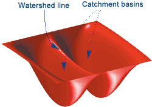

# CS 766: Vision Approaches in Phenotypic Cell Approaches
_Aaron Baker, Ragini Rathore_  
_May 2019_
## Motivation
The cost of developing a drug [is estimated to be somewhere between $320 million to $2.7 billion](https://blogs.sciencemag.org/pipeline/archives/2017/10/18/drug-development-costs-revisited).
Recent technological advances have enabled new approaches to drug development.
In particular, automated lab and microscopy equipment facilitates high-throughput [phenotypic cell profiling experiments](http://dx.doi.org/10.1038/nprot.2016.105).
Phenotypic cell profiling experiments often perturb a cell with a chemical and then measure the effect on the cell.
One way to measure the effect is through microscopic imaging.
Many experiments of this form can be conducted simulatenously by organizing each experiment into a well on a multi-well plate, and by using machines designed to process the plates.

*[Source: Bray et al. 2016](http://dx.doi.org/10.1038/nprot.2016.105)*

This project analyzed a part of [a dataset](http://dx.doi.org/10.1093/gigascience/giw014) which contains images associated with 30,000 chemical treatments of bone cancer cells.
In each experiment, five different dyes are applied to the cells to illuminate different parts of the cell under a microscope.
The cells used for this dataset reside in a DMSO solvent, and DMSO is also used as a treatment control.
The following image shows two sets of sample images from this dataset, one which has been treated with the control and one which has been treated with Parbendazole.

*[Source: Bray et al. 2017](http://dx.doi.org/10.1093/gigascience/giw014)*

There appears to be a significant difference between these two sets of images.
That is, Parbendazole appears to have some effect.
Our project aims to discover these types of differences at a large scale, using computer vision tools to analyze the cell images.
We developed a software pipeline which identifies drugs that affect bone cancer.

1. Segment images of cell populations into images of individual cells.
2. Featurize individual cell images.
3. Train a classifier to distinguish treated and untreated cells.

While a traditional applications of machine learning would be interested in using the classifier to predict whether a new cell image has been treated or not, we note that this interpretation of the classifier is not particularly useful because we already know if the cells have been treated or not.
Instead, if a classifier is able to achieve good performance, there must be some difference between the features of treated and untreated cells.
In that case, the drug has some apparent effect and we recommend that it is studied more thoroughly.

We focused on innovating in the segmentation task, and applied off-the-shelf methods for featurization and classification.
We adapted [Watershed segmentation](https://en.wikipedia.org/wiki/Watershed_%28image_processing%29) and compared it to [k-means clustering](https://scikit-learn.org/stable/modules/generated/sklearn.cluster.KMeans.html).
We featurized cell images by extracting [region](https://scikit-image.org/docs/dev/api/skimage.measure.html#skimage.measure.regionprops) and [texture](https://scikit-image.org/docs/0.7.0/api/skimage.feature.texture.html) properties.
Finally, we classified images using a [simple logistic regression classifier](https://scikit-learn.org/stable/modules/generated/sklearn.linear_model.LogisticRegression.html).
We evaluated the performance of the classifiers by average precision, and plotted precision-recall curves.

## State-of-the-art
[CellProfiler](http://dx.doi.org/10.1186/gb-2006-7-10-r100) is a software suite which provides many utilities, one of which performs cell segmentation.
One of CellProfiler's segmentation tools uses Watershed segmentation, but their research paper notes that Watershed typically oversegments images.
Another CellProfiler segmentation tool is known as Propagate.
Propagate is based on Voronoi partitioning and manifold alignment.
Given a set of points in 2D space which correspond to the location of nucleus centers in a image of a population of cells, a Voronoi diagram partitions the image into regions.
All the points in the region share the property that the closest nucleus center is the one that is also in the region.
A sample Voronoi diagram associated with a cell nucleus channel is given below.

*Voronoi diagram using nuclei centers*

The Voronoi diagram helps overcome a common challenge in the cell segmentation task: cells tend to come into contact with each other, so it is hard to clearly define a boundary separating them based on the pixel intensity values alone.
However, the Voronoi partitioning is primarily a mathematical tool, and it produces a rigid, polygonal segmentation.
This is in contrast to the smoother cell boundaries that we see in the images.
Propagate uses the Voronoi partitioning as a starting point and then smooths the boundary in accordance with the pixel intensity observed in the images.
It utilizes manifold mathematics to transform Voronoi's Euclidean geometry to match the geometry suggested by the cell images.

*Manifold regularization [Source: Kim et al. 2014]()*  

## Implementation
We implemented the watershed algorithm and the K-means clustering algorithm to initial segment the individual cells and to further use the segmented cells to determine a particular drug efficacy using machine learning techniques for classification.
### Segmentation
#### Pre-processing
1. The dataset we used consisted of 5 channels pertaining to the 5 dyes used for illuminating a certain part of the cell. However, the images were not very visible to the naked eye and we had to use a combination of different channels.  
To perfectly determine the cell boundaries, we fused the nuclei channel and the golgi body channel images and used these set of fused grayscale images as our input to the segmentation algorithms. This enables to figure out if our segmentation algorithm segments the individual cell boundaries or fails. It also helps us clearly view the images.  

*Sample dataset fused image*

2. In this pre-processing step, we identified the individual nuclei centers and the total number of nuclei cells in the image. We used the images from the nuclei channel and used [Otsu's thresholding](https://en.wikipedia.org/wiki/Otsu%27s_method) method to find number of nuclei and their centers.  

*Sample image showing detected nuclei centers using Otsu's method.*

#### Segmentation Algorithms
- ###### Watershed Algorithm
Watershed algorithm is used in image processing primarily for segmentation purposes. A watershed is a transformation defined on a grayscale image. The name refers metaphorically to a geological watershed, or drainage divide, which separates adjacent drainage basins. The watershed transformation treats the image it operates upon like a topographic map, with the brightness of each point representing its height, and finds the lines that run along the tops of ridges.
The algorithm floods basins from the initial markers, until basins attributed to different markers meet on watershed lines. These markers are chosen as local minima of the image, from which basins are flooded.  

  
 

Here, we show a sample image passed through the watershed flowchart steps:  
 
  &nbsp; &nbsp;  &nbsp; &nbsp;   
*Intial thresholding* &nbsp; &nbsp;&nbsp; &nbsp;&nbsp; &nbsp;&nbsp; &nbsp;&nbsp; &nbsp;&nbsp;&nbsp;&nbsp;&nbsp;&nbsp;&nbsp;&nbsp;&nbsp;*Distance transform* &nbsp;&nbsp;&nbsp;&nbsp;&nbsp; &nbsp;&nbsp;*Segmented and labelled* &nbsp;&nbsp;&nbsp;&nbsp;&nbsp; &nbsp;&nbsp; *Over-segmented Image*  

Here, we see the watershed algorithm has **over segmented** the cells. So, to prevent watershed from over segmenting, we set the initial markers, which are the local minima in the image, to be the nuclei centers which we found in the pre-processing step and repeat the watershed steps. Using this technique, we obtain properly the segmented images. A sample of the segmented cells is shown below.  

*Segmented Image*  

- ###### K-means Clustering

### Learning using Segmented Cells

## Conclusion

## Difficulties and Challenges
- We needed more compute power to analyze the entire image dataset.
- Several other segmentation algorithms like Snakes, Active Contours failed to detect the individual cell boundaries.
- It is difficult to see the individual channels in the original images.

## Learnings and Future Work
- Segmenting cells is a difficult task due to cell-to-cell contacts.
- Novel frameworks for evaluating drug efficacy can be used.
- Evaluate more drugs with more compute power.
## References
[1] Caicedo, J. C., Cooper, S., Heigwer, F., Warchal, S., Qiu, P., Molnar, C., … Carpenter, A. E.(2017). Data-analysis strategies for image-based cell profiling. Nature Methods, 14(9), 849–863. [https://doi.org/10.1038/nmeth.4397](https://doi.org/10.1038/nmeth.4397)    
[2] Grys, B. T., Lo, D. S., Sahin, N., Kraus, O. Z., Morris, Q., Boone, C., & Andrews, B. J. (2016). Machine learning and computer vision approaches for phenotypic profiling. The Journal of Cell Biology, 216(1), 65–71. [https://doi.org/10.1083/jcb.201610026](https://doi.org/10.1083/jcb.201610026)  
[3] Bray, M.-A., Gustafsdottir, S. M., Rohban, M. H., Singh, S., Ljosa, V., Sokolnicki, K. L., Carpenter, A. E. (2017). A dataset of images and morphological profiles of 30 000 small-molecule treatments using the Cell Painting assay. GigaScience, 6(12). [https://doi.org/10.1093/gigascience/giw014](https://doi.org/10.1093/gigascience/giw014)  
[4] Swinney, D. C., & Anthony, J. (2011). How were new medicines discovered? Nature Reviews Drug Discovery, 10(7), 507–519. [https://doi.org/10.1038/nrd3480](https://doi.org/10.1038/nrd3480)  
[5] Bray, M. A., Singh, S., Han, H., Davis, C. T., Borgeson, B., Hartland, C., & Carpenter, A. E. (2016). Cell Painting, a high-content image-based assay for morphological profiling using multiplexed fluorescent dyes. Nature protocols, 11(9), 1757.  
[6] Otsu, N. (1979). A threshold selection method from gray-level histograms. IEEE transactions on systems, man, and cybernetics, 9(1), 62-66. [https://doi.org/10.1109/TSMC.1979.4310076](https://doi.org/10.1109/TSMC.1979.4310076)  
[7] Barnes, R., Lehman, C., Mulla, D., 2014. Priority-flood: An optimal depression-filling and watershed-labeling algorithm for digital elevation models. Computers & Geosciences 62, 117–127. [https://doi.org/10.1016/j.cageo.2013.04.024](https://doi.org/10.1016/j.cageo.2013.04.024)  
